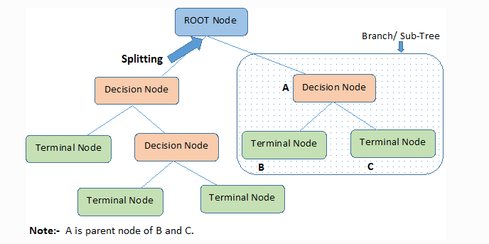

## Practical 03

## Problem Statement

**Decision Tree Learning**

1. Implement the Decision Tree Learning algorithm to build a decision tree for a given dataset.
2. Evaluate the accuracy and effectiveness of the decision tree on test data.
3. Visualize and interpret the generated decision tree.

Decision Tree algorithm belongs to the family of supervised learning algorithms. Unlike other supervised learning algorithms, the decision tree algorithm can be used for solving **regression and classification problems** too.

The goal of using a Decision Tree is to create a training model that can use to predict the class or value of the target variable by **learning simple decision rules** inferred from prior data(training data).

### Types of Decision Trees

Types of decision trees are based on the type of target variable we have. It can be of two types:

1. **Categorical Variable Decision Tree:** Decision Tree which has a categorical target variable then it called a **Categorical variable decision tree.**
2. **Continuous Variable Decision Tree:** Decision Tree has a continuous target variable then it is called **Continuous Variable Decision Tree.**

## **Terminology related to Decision Trees**

1. **Root Node:** It represents the entire population or sample and this further gets divided into two or more homogeneous sets.
2. **Splitting:** It is a process of dividing a node into two or more sub-nodes.
3. **Decision Node:** When a sub-node splits into further sub-nodes, then it is called the decision node.
4. **Leaf / Terminal Node:** Nodes do not split is called Leaf or Terminal node.
5. **Pruning:** When we remove sub-nodes of a decision node, this process is called pruning. You can say the opposite process of splitting.
6. **Branch / Sub-Tree:** A subsection of the entire tree is called branch or sub-tree.
7. **Parent and Child Node:** A node, which is divided into sub-nodes is called a parent node of sub-nodes whereas sub-nodes are the child of a parent node.
    
    

    

## Algorithm

The decision of making strategic splits heavily affects a tree’s accuracy. The decision criteria are different for classification and regression trees.

The ID3 algorithm builds decision trees using a top-down [greedy search](https://www.hackerearth.com/practice/algorithms/greedy/basics-of-greedy-algorithms/tutorial/) approach through the space of possible branches with no backtracking. A greedy algorithm, as the name suggests, always makes the choice that seems to be the best at that moment.

Steps in ID3 algorithm.

1. It begins with the original set S as the root node.
2. On each iteration of the algorithm, it iterates through the very unused attribute of the set S and calculates **Entropy(H)** and **Information gain(IG)** of this attribute.
3. It then selects the attribute which has the smallest Entropy or Largest Information gain.
4. The set S is then split by the selected attribute to produce a subset of the data.
5. The algorithm continues to recur on each subset, considering only attributes never selected before.

## Time and Space Complexity

1. The train time complexity for the ID3 algorithms would be 
    
    $$
    O (n * logn * d)
    $$
    
    where,
    
     $n$ is the number of data points
    
    $d$ is the number of dimensions
    
2. The train space time complexity would be $O(nodes)$.
3. The test time complexity would be $O(depth)$.
4. The test space complexity would be $O(nodes)$.
