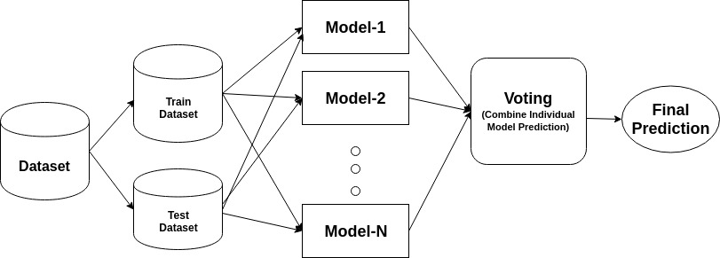

## Practical 06

## Problem Statement

**Adaboost Ensemble Learning**

1. Implement the Adaboost algorithm to create an ensemble of weak classifiers.
2. Train the ensemble model on a given dataset and evaluate its performance.
3. Compare the results with individual weak classifiers.

---

An ensemble is a composite model, combines a series of low performing classifiers with the aim of creating an improved classifier. Here, individual classifier vote and final prediction label returned that performs majority voting. Ensembles offer more accuracy than individual or base classifier. Ensemble methods can parallelize by allocating each base learner to different-different machines.

Ada-boost or Adaptive Boosting is one of ensemble boosting classifier proposed by Yoav Freund and Robert Schapire in 1996. It combines multiple classifiers to increase the accuracy of classifiers. AdaBoost is an iterative ensemble method. AdaBoost classifier builds a strong classifier by combining multiple poorly performing classifiers so that you will get high accuracy strong classifier. The basic concept behind Adaboost is to set the weights of classifiers and training the data sample in each iteration such that it ensures the accurate predictions of unusual observations. Any machine learning algorithm can be used as base classifier if it accepts weights on the training set. Adaboost should meet two conditions:

1. The classifier should be trained interactively on various weighed training examples.
2. In each iteration, it tries to provide an excellent fit for these examples by minimizing training error.

## Alogrithm

1. Initially, Adaboost selects a training subset randomly.
2. It iteratively trains the AdaBoost machine learning model by selecting the training set based on the accurate prediction of the last training.
3. It assigns the higher weight to wrong classified observations so that in the next iteration these observations will get the high probability for classification.
4. Also, It assigns the weight to the trained classifier in each iteration according to the accuracy of the classifier. The more accurate classifier will get high weight.
5. This process iterate until the complete training data fits without any error or until reached to the specified maximum number of estimators.
6. To classify, perform a "vote" across all of the learning algorithms you built.

---