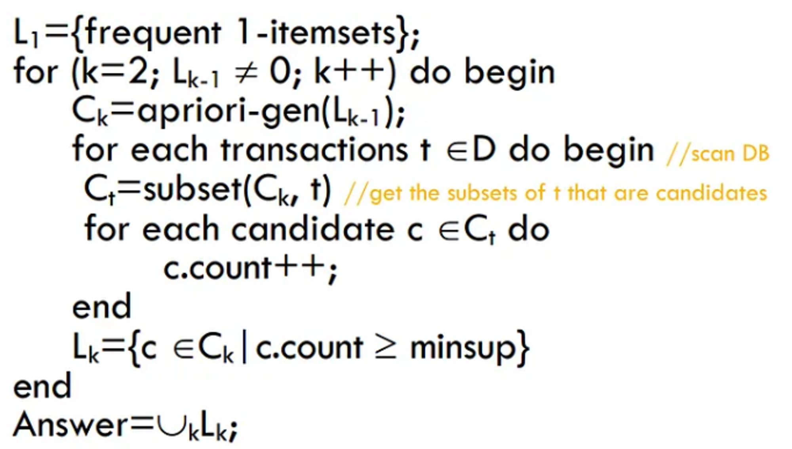

## Practical 09

## Problem Statement

**Association Rule Mining**

1. Implement the Association Rule Mining algorithm (e.g., Apriori) to find frequent itemsets.
1. Generate association rules from the frequent itemsets and calculate their support and confidence.
1. Interpret and analyze the discovered association rules.

---

Association rule mining is a technique to identify underlying relations between different items. There are many methods to perform association rule mining. The Apriori algorithm that we are going to introduce in this article is the most simple and straightforward approach.

## ****Concepts of Apriori****

### ****Support****

1. *Fraction of transactions that contain an itemset.*
2. For example, the support of item I is defined as the number of transactions containing I divided by the total number of transactions.
    
    $$
    support(I) = \frac{Number \quad of \quad transactions \quad containing \quad I}{Total \quad number \quad of \quad transactions}
    $$
    

### ****Confidence****

1. *Measures how often items in Y appear in transactions that contain X*
2. Confidence is the likelihood that item Y is also bought if item X is bought. It’s calculated as the number of transactions containing X and Y divided by the number of transactions containing X.
    
    $$
    confidence(X \rarr Y) = \frac{Number \quad of \quad transactions \quad containing \quad X \quad and \quad Y}{Number \quad of \quad transactions \quad containing \quad X}
    $$
    

### ****Frequent Item Set****

1. *An itemset whose support is greater than or equal to a minSup threshold*
2. Frequent itemsets or also known as frequent pattern simply means all the itemsets that the support satisfies the minimum support threshold.

---

## ****Algorithm****

---